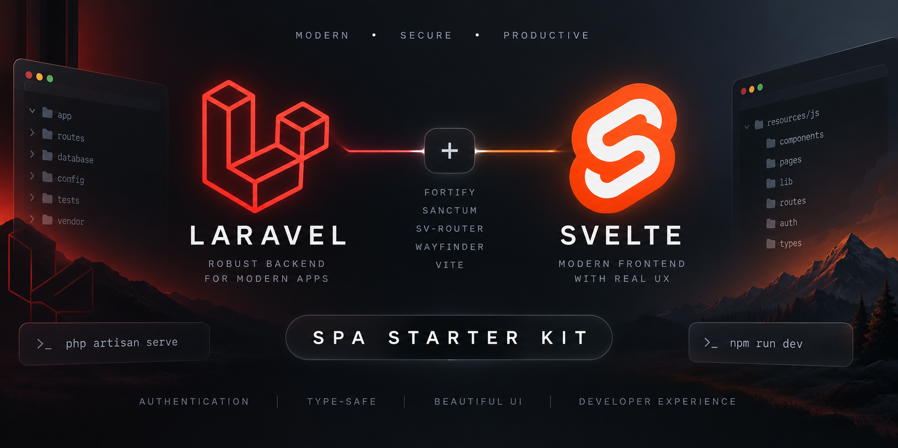

# Laravel Svelte SPA Starter Kit

[](https://github.com/muradyanvano/laravel-svelte-spa-starter-kit/actions/workflows/tests.yml)
[](https://packagist.org/packages/muradyanvano/laravel-svelte-spa-starter-kit)
[](https://packagist.org/packages/muradyanvano/laravel-svelte-spa-starter-kit)
[](https://packagist.org/packages/muradyanvano/laravel-svelte-spa-starter-kit)
[](https://laravel.com)
[](LICENSE)

<p align="center">
    
</p>

A community Laravel starter kit with **official-style UI** and a **true Svelte
SPA** — client-side routing with **sv-router**, cookie/session auth with
**Sanctum**, and headless **Fortify** — **without Inertia**.

> **Community / unofficial.** This is not an official Laravel starter kit, not
> endorsed by Laravel, and not maintained by Laravel. See [NOTICE.md](NOTICE.md).

## Why this starter kit

Many Laravel + Svelte projects use Inertia to bridge server and client routing.
This kit takes a different path: a **first-party SPA** that feels like Laravel's
official starter kits while keeping **client-side navigation** in Svelte.

```
Laravel
  ↓
Fortify + Sanctum
  ↓
Blade SPA shell
  ↓
Svelte 5 + sv-router
  ↓
Axios
```

You get:

- Familiar Laravel auth and settings flows
- Svelte 5 with TypeScript
- sv-router for client-side routes and guards
- Sanctum cookie/session SPA authentication (no JWT in the browser)
- Fortify headless auth endpoints
- Laravel Wayfinder for typed route helpers
- Vite + Vite Plus for dev, build, lint, and tests

## Quick start

Install the latest stable release from
[Packagist](https://packagist.org/packages/muradyanvano/laravel-svelte-spa-starter-kit)
using the Laravel Installer:

```bash
laravel new my-app --using=muradyanvano/laravel-svelte-spa-starter-kit
```

Or with Composer:

```bash
composer create-project muradyanvano/laravel-svelte-spa-starter-kit my-app
```

Both commands resolve the package from Packagist. The latest stable release is
**v1.0.0**; an unpinned install uses the current stable version. Passkey support
ships in the upcoming **v1.1.0** release (see [Unreleased] in
[CHANGELOG.md](CHANGELOG.md)).

**Install a specific version** (for example, to stay on v1.0.0):

```bash
composer create-project muradyanvano/laravel-svelte-spa-starter-kit my-app v1.0.0
```

### Clone from GitHub

To work from source or preview unreleased changes (including passkeys on
`develop`):

```bash
git clone https://github.com/muradyanvano/laravel-svelte-spa-starter-kit.git my-app
cd my-app
composer setup
```

Or step by step:

```bash
composer install
cp .env.example .env   # Windows: copy .env.example .env
php artisan key:generate
php artisan migrate
npm install
npm run build
```

Configure your web server (or [Laravel Herd](https://herd.laravel.com/)) to
serve the application. For local development with hot reload:

```bash
composer run dev
```

## Features

### Authentication

- Login (email/password and passkey)
- Registration
- Password reset
- Email verification
- Password confirmation (password or passkey)
- Passkey sign-in (`Sign in with a passkey`)
- Passkey management under Security (list, register, delete)
- Two-factor challenge (password login only)
- Two-factor setup and management (TOTP)
- Recovery codes (lazy-loaded on explicit view)
- Logout

Passkeys use the official [`@laravel/passkeys`](https://www.npmjs.com/package/@laravel/passkeys)
frontend package with native Fortify WebAuthn endpoints. WebAuthn support depends on
the browser and platform (for example Windows Hello, Touch ID, or a security key).
Passkey credentials are verified by the server; they are not stored in browser
`localStorage` or `sessionStorage`.

### Application

- Svelte 5 SPA with sv-router client-side routing
- Authenticated application shell with responsive sidebar
- Collapsible sidebar (state persisted via cookie)
- Mobile navigation
- Dashboard
- Profile settings (name, email, account deletion)
- Security settings (password, two-factor authentication, passkeys)
- Appearance settings (Light / Dark / System)
- UI built with Tailwind CSS 4 and bits-ui primitives
- Accessible form patterns (`aria-*`, error associations)

### Developer experience

- TypeScript
- Axios HTTP layer with normalized errors
- Laravel Wayfinder (generated route/action helpers)
- Vite 8 + Vite Plus (`vp dev`, `vp build`, `vp check`, `vp test`)
- Pest (backend)
- Vitest + Testing Library (frontend)
- svelte-check
- PHPStan (via Larastan)
- Laravel Pint
- Aggregate CI gate: `composer ci:check`

## Architecture

```
Browser
  |
  +-- Blade SPA shell (app.blade.php)
        |
        +-- Svelte 5 (components, layouts, pages)
        +-- sv-router (client routes + guards)
        +-- Axios (http.ts)
              |
              +-- Sanctum CSRF + session cookies
              +-- Fortify auth endpoints
              +-- /api/v1/* JSON APIs
```

| Layer         | Responsibility                                                           |
| ------------- | ------------------------------------------------------------------------ |
| **Laravel**   | Sessions, APIs, validation, authorization, persistence                   |
| **Svelte**    | Client routing, layouts, UI, forms, auth state consumption               |
| **Fortify**   | Headless login, register, reset, verify, 2FA, passkeys, profile/password |
| **Sanctum**   | First-party SPA cookie/session authentication                            |
| **sv-router** | Client-side routing and navigation guards                                |
| **Axios**     | HTTP client, CSRF cookie, error normalization                            |
| **Wayfinder** | Generated TypeScript helpers for Laravel routes/actions                  |

Hard refreshes on frontend routes are served by Laravel (`SpaController`);
in-app navigation is handled entirely by sv-router.

## Auth and security

- **Sanctum** first-party SPA authentication using session cookies
- **CSRF cookie** fetched before mutating requests (`/sanctum/csrf-cookie`)
- Auth state lives in memory via Svelte module runes — **no** bearer tokens in
  `localStorage` or `sessionStorage`
- Laravel validation on all mutations
- Email verification for protected routes
- Password confirmation for sensitive settings
- Two-factor authentication with TOTP; recovery codes fetched only when the user
  clicks **View recovery codes**
- **Passkeys** via Fortify and `@laravel/passkeys`: sign-in, password confirmation,
  and Security settings management. WebAuthn ceremonies are owned by the official
  passkeys package; Axios owns ordinary SPA APIs and Fortify mutations.
- **Passkey login and 2FA:** when two-factor authentication is enabled, native
  Fortify passkey login authenticates the session directly (the same behavior as
  Laravel's official starter kits). Password login still routes through the
  two-factor challenge when required.

**Consumer responsibility:** You are responsible for HTTPS, production cookie
settings, `SANCTUM_STATEFUL_DOMAINS`, CORS, secrets, mail configuration,
authorization policies, dependency updates, infrastructure hardening, and
security review of your own application code.

See [SECURITY.md](SECURITY.md) for vulnerability reporting.

## Appearance

Three modes: **Light**, **Dark**, and **System**.

The selected theme persists (via cookie) and first-paint handling in the Blade
shell reduces obvious theme flash on load. The Appearance settings page drives
the shared theme store only — it makes no API calls.

## Development

| Command                      | Description                                                  |
| ---------------------------- | ------------------------------------------------------------ |
| `composer run dev`           | Laravel dev server + Vite + queue + logs (via `artisan dev`) |
| `npm run dev`                | Vite dev server only                                         |
| `npm run build`              | Production frontend build                                    |
| `npm run check`              | Frontend format + lint                                       |
| `npm run check:fix`          | Auto-fix format/lint issues                                  |
| `npm run types:check`        | Regenerate Wayfinder + svelte-check                          |
| `npm run test`               | Vitest                                                       |
| `npm run test:watch`         | Vitest watch mode                                            |
| `npm run wayfinder:generate` | Regenerate Wayfinder output                                  |
| `composer test`              | Pint + PHPStan + Pest                                        |
| `composer ci:check`          | Full frontend + backend quality gate                         |
| `composer setup`             | Install deps, env, migrate, npm install, build               |

## Testing and quality

Backend tests use **Pest**. Frontend tests use **Vitest** with Testing Library.

Static analysis and formatting:

- **PHPStan** (Larastan) — `composer types:check`
- **Pint** — `composer lint` / `composer lint:check`
- **svelte-check** — `npm run types:check`
- **Vite Plus check** — `npm run check` (format + lint)

Run everything before a PR:

```bash
composer ci:check
```

Production build verification:

```bash
npm run build
```

## Wayfinder

Generated directories (gitignored — **do not commit**):

- `resources/js/actions`
- `resources/js/routes`
- `resources/js/wayfinder`

Regenerate manually:

```bash
npm run wayfinder:generate
```

`npm run types:check` and `npm run build` also regenerate Wayfinder as
configured. Fresh clones start without these directories; generation happens
during type-check or build.

## Laravel Boost (optional)

[Laravel Boost](https://github.com/laravel/boost) is included as a **dev**
dependency for optional AI-assisted development. It is **not** required to run,
build, or test the application.

```bash
php artisan boost:install
```

Boost configuration (`boost.json`, `AGENTS.md`, etc.) is author-local and
gitignored. Composer lifecycle scripts do **not** run `boost:update`.

## Attribution

UI and developer experience were **inspired by** Laravel's official Svelte
starter kit. This is a **community reimplementation** as a true SPA without
Inertia.

See [NOTICE.md](NOTICE.md) for upstream reference and licensing details.

## Requirements

|         | Version               |
| ------- | --------------------- |
| PHP     | ^8.3                  |
| Laravel | ^13                   |
| Svelte  | ^5                    |
| Node.js | 22+ (25 tested in CI) |

## Links

- [GitHub repository](https://github.com/muradyanvano/laravel-svelte-spa-starter-kit)
- [Packagist](https://packagist.org/packages/muradyanvano/laravel-svelte-spa-starter-kit)
- [Laravel](https://laravel.com)
- [Svelte](https://svelte.dev)
- [sv-router](https://github.com/kaisermann/sv-router)
- [CONTRIBUTING.md](CONTRIBUTING.md)
- [SECURITY.md](SECURITY.md)
- [LICENSE](LICENSE)
- [NOTICE.md](NOTICE.md)

## License

This project is open-sourced software licensed under the [MIT License](LICENSE).
